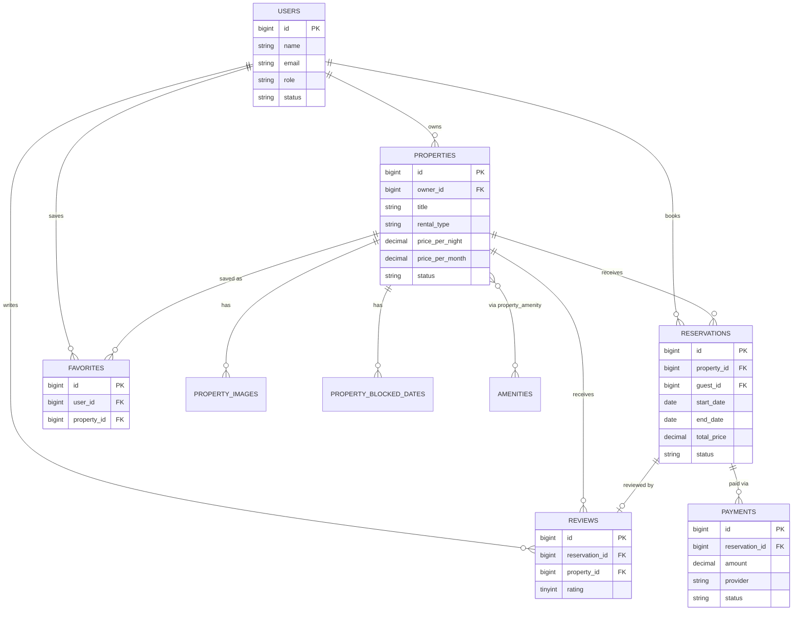

# Kridar — Architecture Plan (Rebuild from Scratch)

**Status:** Phase 1 — Architecture & Database Design
**Stack:** Laravel 12 (API) + React (Vite, TypeScript) + MySQL 8 + Sanctum
**Scope confirmed with Ayoub (2026-09-02):**
- Rental types: **both** short-term (nightly, calendar-based) and long-term (monthly lease)
- Roles: **Guest / Owner / Admin** — a single account can be both Guest and Owner at once (ownership is implicit: you become an "owner" the moment you list a property, no separate signup flow)
- Payments: schema designed now (`payments` table) so no painful migration later, but the CMI gateway integration itself is a **separate later phase**, not part of this rebuild's first passes

---

## 1. Complete Architecture

**Style:** Decoupled architecture — Laravel is a pure JSON REST API (versioned under `/api/v1`), React is a separate SPA that consumes it. No Blade views except password-reset/email-verification landing pages.

```
┌─────────────────┐        HTTPS / JSON         ┌──────────────────────┐
│  React SPA       │ ───────────────────────────▶ │  Laravel 12 API       │
│  (Vite + TS)      │ ◀─────────────────────────── │  /api/v1/...          │
└─────────────────┘        Sanctum cookie          └──────────┬───────────┘
                                                                │
                                    ┌───────────────────────────┼───────────────────────────┐
                                    ▼                            ▼                            ▼
                              MySQL 8                     Queue (DB/Redis)              Storage disk
                          (all app data)              (emails, notifications)        (property images)
```

**Backend layering (Repository Pattern + Service Layer — same pattern you already use):**

```
Route → Controller → FormRequest (validation+authorization) → Service (business logic)
      → Repository (data access, Eloquent hidden behind an interface) → Model
Controller → API Resource (shapes the JSON response)
```

Why this matters for Kridar specifically: availability checks, price calculation, and booking-conflict rules are **business logic**, not query logic — they belong in Services, not Controllers or Models. Repositories exist so Services never call `Property::where(...)` directly; this makes the booking-conflict logic (section 8) unit-testable without hitting a real database.

Other backend building blocks we'll use as the project grows:
- **Policies** — authorization ("can this user edit this property?", "can this user cancel this reservation?")
- **Events/Listeners** — e.g. `ReservationConfirmed` → send notification + email
- **Jobs/Queue** — emails, notifications, and a scheduled job that flips `confirmed` reservations to `completed` after `end_date` passes
- **Enums (PHP backed enums)** — `ReservationStatus`, `PropertyStatus`, `RentalType`, etc., stored as `string` columns in the DB and cast to enums on the model (safer than MySQL native `ENUM` columns — adding a value later doesn't require a schema change)
- **Form Requests** — every write endpoint validates on the backend regardless of what the frontend already checked

**Infrastructure choices:**
- Database: **MySQL 8**
- File storage: Laravel Filesystem, local disk for dev, swappable to S3-compatible storage for prod without code changes
- Cache/Queue: database driver to start (simplest), Redis later if load requires it
- API versioning: `/api/v1/...` from day one, so `v2` can be introduced later without breaking the current frontend

---

## 2. Backend Folder Structure (Laravel 12)

```
app/
├── Enums/
│   ├── UserRole.php
│   ├── PropertyStatus.php
│   ├── RentalType.php
│   ├── ReservationStatus.php
│   └── PaymentStatus.php
├── Events/
│   ├── ReservationCreated.php
│   └── ReservationStatusChanged.php
├── Exceptions/
│   └── PropertyNotAvailableException.php
├── Http/
│   ├── Controllers/Api/V1/
│   │   ├── Auth/ (AuthController, PasswordResetController)
│   │   ├── PropertyController.php
│   │   ├── PropertyImageController.php
│   │   ├── ReservationController.php
│   │   ├── ReviewController.php
│   │   ├── FavoriteController.php
│   │   ├── NotificationController.php
│   │   ├── Owner/ (OwnerPropertyController, OwnerReservationController, OwnerStatsController)
│   │   └── Admin/ (AdminUserController, AdminPropertyController, AdminStatsController)
│   ├── Requests/
│   │   ├── Auth/ (RegisterRequest, LoginRequest)
│   │   ├── Property/ (StorePropertyRequest, UpdatePropertyRequest, PropertySearchRequest)
│   │   ├── Reservation/ (StoreReservationRequest)
│   │   └── Review/ (StoreReviewRequest)
│   ├── Resources/
│   │   ├── UserResource.php
│   │   ├── PropertyResource.php
│   │   ├── PropertyImageResource.php
│   │   ├── ReservationResource.php
│   │   ├── ReviewResource.php
│   │   └── PaymentResource.php
│   └── Middleware/
├── Models/
│   ├── User.php
│   ├── Property.php
│   ├── PropertyImage.php
│   ├── PropertyBlockedDate.php
│   ├── Amenity.php
│   ├── Reservation.php
│   ├── Payment.php
│   ├── Review.php
│   └── Favorite.php
├── Policies/
│   ├── PropertyPolicy.php
│   ├── ReservationPolicy.php
│   └── ReviewPolicy.php
├── Repositories/
│   ├── Contracts/ (PropertyRepositoryInterface.php, ReservationRepositoryInterface.php, ...)
│   └── Eloquent/ (EloquentPropertyRepository.php, EloquentReservationRepository.php, ...)
├── Services/
│   ├── PropertyService.php
│   ├── AvailabilityService.php
│   ├── ReservationService.php
│   ├── PricingService.php
│   ├── ReviewService.php
│   └── FavoriteService.php
├── Notifications/
│   ├── ReservationRequested.php
│   ├── ReservationConfirmed.php
│   └── ReservationCancelled.php
├── Jobs/
│   └── CompletePastReservations.php   (scheduled job)
└── Providers/
    └── RepositoryServiceProvider.php   (binds interfaces → Eloquent implementations)

database/
├── migrations/
├── factories/
└── seeders/

routes/
└── api.php   (all routes prefixed /api/v1 via a route group)

tests/
├── Feature/   (endpoint tests: booking flow, auth flow, availability conflicts)
└── Unit/      (Services in isolation, e.g. AvailabilityService overlap logic)
```

---

## 3. Frontend Folder Structure (React + Vite + TypeScript)

Feature-based structure (not "everything in `components/`") so each domain (properties, reservations, reviews...) is self-contained and easy to navigate as the app grows to 20+ phases.

```
src/
├── api/
│   ├── axiosClient.ts        (base axios instance, withCredentials: true for Sanctum)
│   ├── authApi.ts
│   ├── propertyApi.ts
│   ├── reservationApi.ts
│   ├── reviewApi.ts
│   └── favoriteApi.ts
├── app/
│   ├── App.tsx
│   ├── router.tsx             (React Router v6 route definitions)
│   └── providers.tsx          (QueryClientProvider, AuthProvider, etc.)
├── features/
│   ├── auth/            (LoginForm, RegisterForm, useAuth hook, authStore)
│   ├── properties/      (PropertyCard, PropertyFilters, PropertyGallery, usePropertyList)
│   ├── reservations/    (BookingForm, AvailabilityCalendar, useAvailability, ReservationStatusBadge)
│   ├── reviews/
│   ├── favorites/
│   ├── notifications/
│   ├── owner-dashboard/
│   └── admin-dashboard/
├── components/
│   ├── ui/               (Button, Input, Modal, Badge — generic, no business logic)
│   └── layout/            (Navbar, Footer, ProtectedRoute, OwnerRoute, AdminRoute)
├── hooks/                 (shared hooks not tied to one feature)
├── lib/                   (constants, formatters, date helpers, validators)
├── pages/                 (route-level screens composed from features)
│   ├── HomePage.tsx
│   ├── PropertyDetailsPage.tsx
│   ├── owner/
│   └── admin/
├── types/                 (shared TS interfaces mirroring backend API Resources)
├── main.tsx
└── index.css
```

**State management:**
- **TanStack Query (React Query)** for all server state (properties, reservations, etc.) — caching, refetching, loading/error states handled for you instead of hand-rolled `useEffect` + `useState`.
- **Zustand (or React Context)** only for small client-only state — the logged-in user, UI toggles. Simpler than Redux, easy to explain.
- **React Router v6** for routing, with `ProtectedRoute` / `OwnerRoute` / `AdminRoute` wrapper components gating pages by role.

---

## 4. Database Tables

| Table | Purpose |
|---|---|
| `users` | Guests, owners, admins — one table, role distinguishes admin, ownership is implicit via `properties.owner_id` |
| `properties` | Listings — supports both short-term and long-term via `rental_type` |
| `amenities` | Master list (WiFi, Parking, Pool...) |
| `property_amenity` | Pivot: property ↔ amenities |
| `property_images` | Photos per property |
| `property_blocked_dates` | Owner-blocked dates (maintenance, personal use) — checked in availability alongside reservations |
| `reservations` | Bookings — unified table for both nightly and monthly rentals |
| `payments` | Schema only for now — transaction records tied to a reservation |
| `reviews` | One review per completed reservation |
| `favorites` | User ↔ property "saved" list |
| `notifications` | Laravel's built-in polymorphic notifications table (no custom design needed) |

### `users`
| Column | Type | Notes |
|---|---|---|
| id | bigint PK | |
| name | string | |
| email | string, unique | |
| email_verified_at | timestamp, nullable | |
| phone | string, nullable | |
| password | string (hashed) | |
| avatar_path | string, nullable | |
| role | string (enum: `user`, `admin`) | default `user` |
| owner_verified_at | timestamp, nullable | reserved for a future owner-KYC step, not enforced in MVP |
| status | string (enum: `active`, `suspended`) | default `active` |
| created_at / updated_at / deleted_at | | soft deletes |

### `properties`
| Column | Type | Notes |
|---|---|---|
| id | bigint PK | |
| owner_id | FK → users.id | |
| title | string | |
| slug | string, unique | |
| description | text | |
| property_type | string (enum: `apartment`, `villa`, `studio`, `riad`, `office`, ...) | |
| rental_type | string (enum: `short_term`, `long_term`, `both`) | which price fields are active |
| address, city, region | string | |
| country | string | default `Morocco` |
| latitude, longitude | decimal, nullable | for map view |
| bedrooms, bathrooms | tinyint | |
| max_guests | tinyint, nullable | required if short_term |
| area_sqm | decimal, nullable | |
| price_per_night | decimal, nullable | required if rental_type is short_term/both |
| price_per_month | decimal, nullable | required if rental_type is long_term/both |
| currency | string | default `MAD` |
| status | string (enum: `draft`, `pending_review`, `published`, `suspended`, `archived`) | |
| is_featured | boolean | default false |
| published_at | timestamp, nullable | |
| created_at / updated_at / deleted_at | | soft deletes |

### `property_images`
id, property_id (FK), path, is_cover (bool), sort_order, created_at

### `property_blocked_dates`
id, property_id (FK), start_date, end_date, reason (string, nullable), created_by (FK users), created_at

### `amenities` / `property_amenity`
`amenities`: id, name, icon, category
`property_amenity`: property_id (FK), amenity_id (FK) — composite unique

### `reservations`
| Column | Type | Notes |
|---|---|---|
| id | bigint PK | |
| property_id | FK → properties.id | |
| guest_id | FK → users.id | |
| rental_type | string (enum: `short_term`, `long_term`) | snapshot at booking time |
| start_date | date | |
| end_date | date | |
| unit_price | decimal | snapshot of price_per_night or price_per_month at booking time |
| total_price | decimal | **always computed server-side**, never trusted from frontend |
| guests_count | tinyint, nullable | relevant for short_term |
| status | string (enum: `pending`, `confirmed`, `rejected`, `cancelled`, `completed`) | |
| cancellation_reason | text, nullable | |
| cancelled_at | timestamp, nullable | |
| created_at / updated_at | | |

### `payments` (schema now, CMI integration later)
id, reservation_id (FK), user_id (FK), amount, currency, provider (string: `cmi`, `cash`, `bank_transfer`), provider_transaction_id (string, nullable), status (string: `pending`, `paid`, `failed`, `refunded`), paid_at (nullable), created_at

### `reviews`
id, reservation_id (FK, unique — one review per booking), property_id (FK, denormalized for fast queries), guest_id (FK), rating (tinyint 1–5), comment (text), owner_reply (text, nullable), owner_replied_at (nullable), created_at

### `favorites`
id, user_id (FK), property_id (FK), created_at — unique(user_id, property_id)

### `notifications`
Laravel's default migration (`id` uuid, `type`, `notifiable_type`, `notifiable_id`, `data` json, `read_at`, `created_at`) — no custom design needed, ships with Laravel.

---

## 5. Database Relationships

- `User` 1—N `Property` (as owner, via `properties.owner_id`)
- `User` 1—N `Reservation` (as guest, via `reservations.guest_id`)
- `Property` 1—N `Reservation`
- `Property` N—N `Amenity` (through `property_amenity`)
- `Property` 1—N `PropertyImage`
- `Property` 1—N `PropertyBlockedDate`
- `Reservation` 1—N `Payment` (allows retries/refund records, not just one row)
- `Reservation` 1—1 `Review` (nullable — only after `completed`)
- `Property` 1—N `Review` (denormalized `property_id` for fast "reviews for this property" queries)
- `User` N—N `Property` through `Favorite`
- `User` 1—N `Notification` (Laravel's polymorphic `notifiable`)

---

## 6. ERD



---

## 7. Authentication Strategy

**Laravel Sanctum, SPA mode (cookie-based, not tokens)** — the right choice here because the frontend and backend are one product served under the same top-level domain (or configured `SANCTUM_STATEFUL_DOMAINS`), so we get CSRF-protected session auth with no token-expiry headaches.

Flow:
1. Frontend calls `GET /sanctum/csrf-cookie` once on app load → Laravel sets an XSRF-TOKEN cookie.
2. `POST /api/v1/auth/register` or `/api/v1/auth/login` with credentials → Laravel authenticates and starts a session (HttpOnly, Secure cookie).
3. Every subsequent axios request automatically carries the cookie (`withCredentials: true`), no manual token management on the frontend.
4. `GET /api/v1/auth/me` on app load to hydrate the logged-in user into the frontend auth store.
5. `POST /api/v1/auth/logout` invalidates the session.

Supporting pieces:
- **Email verification** — Laravel's `MustVerifyEmail`; a `verified` middleware guards sensitive actions (creating a property, booking a reservation).
- **Password reset** — Laravel's standard signed-link email flow.
- **Authorization** — `role` (`user`/`admin`) handles platform-wide admin powers; everything else (can this user edit this property, cancel this reservation) is resource-level via **Policies**, checked against `owner_id`/`guest_id`, not a global role.
- **Rate limiting** — `throttle` middleware on login/register to slow brute-force attempts.
- **Future mobile app** — Sanctum also supports personal-access-token auth on the same backend, so a future mobile app doesn't require a second auth system, just a different guard.

---

## 8. Reservation & Availability Logic

This is the most important business rule in the whole app — get this wrong and two guests can book the same dates.

**Availability rule:** a property is available for `[start_date, end_date)` if there is no *overlapping* record in either `reservations` (status `pending` or `confirmed`) or `property_blocked_dates` for that property.

Date-range overlap test (standard interval intersection):
```
overlaps = NOT (new.end_date <= existing.start_date OR new.start_date >= existing.end_date)
         = new.start_date < existing.end_date AND new.end_date > existing.start_date
```

**Why `pending` also blocks dates:** if only `confirmed` blocked availability, two guests could both submit a request for the same week and only one could ever be confirmed — but the loser would have been shown "available" and gotten a request rejected after the fact. Instead: `pending` holds the dates temporarily, and Kridar auto-expires a `pending` reservation that isn't confirmed within a set window (e.g. 24h) via a scheduled job — this is the default "request-to-book" model. (An "instant book" mode where `pending` is skipped entirely is a reasonable future property-level setting, but not needed for the rebuild's first pass.)

**Race condition handling:** two users could submit a booking request for the same dates at nearly the same instant. `AvailabilityService::isAvailable()` and the reservation creation must run inside **one DB transaction** with a row lock (`lockForUpdate()`) on the property (or on the set of overlapping reservations) so the second request's overlap check runs *after* the first request's insert is visible, not concurrently against stale data. This is an application-level lock — MySQL has no native "no overlapping ranges" constraint, so the transaction + lock is what actually prevents double-booking.

**Pricing (always computed server-side in `PricingService`, never trusted from the frontend):**
- Short-term: `nights = end_date - start_date`, `total_price = nights * price_per_night`
- Long-term: `months = diff in months between start_date and end_date`, `total_price = months * price_per_month`
- `unit_price` and `total_price` are snapshotted onto the `reservations` row at booking time, so a later price change by the owner doesn't retroactively change past bookings.

**Status lifecycle:**
```
pending → confirmed → completed   (happy path; "completed" flips automatically once end_date has passed, via a scheduled job)
pending → rejected                (owner declines)
pending/confirmed → cancelled     (guest or owner cancels; cancellation_reason recorded)
```

**Availability endpoint for the frontend calendar:** `GET /properties/{id}/availability?start=&end=` returns the list of already-booked/blocked date ranges in that window, so the React `AvailabilityCalendar` component can grey out unavailable dates before the guest even submits a request.

---

## 9. API Endpoint Structure

All endpoints prefixed `/api/v1`. Public = no auth required.

**Auth**
```
POST   /auth/register
POST   /auth/login
POST   /auth/logout                 (auth)
GET    /auth/me                     (auth)
POST   /auth/forgot-password
POST   /auth/reset-password
POST   /auth/email/verify/{id}/{hash}
```

**Properties** (public read, auth write)
```
GET    /properties                  (list, search & filters — public)
GET    /properties/{id}             (details — public)
POST   /properties                  (create — auth; creator becomes the owner)
PUT    /properties/{id}             (update — owner or admin)
DELETE /properties/{id}             (soft delete — owner or admin)
POST   /properties/{id}/images      (upload — owner)
DELETE /properties/{id}/images/{imageId}   (owner)
GET    /properties/{id}/availability?start=&end=   (public)
```

**Reservations** (auth)
```
GET    /reservations                (own bookings, as guest)
POST   /reservations                (create booking request)
GET    /reservations/{id}
PATCH  /reservations/{id}/cancel
PATCH  /reservations/{id}/confirm   (owner)
PATCH  /reservations/{id}/reject    (owner)
```

**Reviews**
```
GET    /properties/{id}/reviews             (public)
POST   /reservations/{id}/review            (auth, guest — only if reservation is completed)
PATCH  /reviews/{id}                        (auth, owner — reply only)
```

**Favorites** (auth)
```
GET    /favorites
POST   /favorites/{propertyId}
DELETE /favorites/{propertyId}
```

**Notifications** (auth)
```
GET    /notifications
PATCH  /notifications/{id}/read
PATCH  /notifications/read-all
```

**Owner dashboard** (auth, must own at least one property)
```
GET    /owner/properties
GET    /owner/reservations
GET    /owner/stats
```

**Admin** (auth, role=admin)
```
GET    /admin/users
PATCH  /admin/users/{id}/suspend
GET    /admin/properties
PATCH  /admin/properties/{id}/approve
PATCH  /admin/properties/{id}/suspend
GET    /admin/stats
```

---

## 10. Development Roadmap

This follows the phase plan already set for the project, confirmed here so both of us stay in sync. One addition flagged below.

| Phase | Scope |
|---|---|
| 1 | **Architecture & database design — this document** |
| 2 | Laravel backend initialization |
| 3 | Migrations, models, factories, seeders |
| 4 | Authentication (Sanctum) |
| 5 | Property/listing management |
| 6 | Property images |
| 7 | Search and filters |
| 8 | Reservations and availability |
| **8.5 (new — flagged for your confirmation)** | **Payments (CMI integration)** — schema exists from Phase 1, but the actual gateway integration needs its own phase; logical to slot right after reservations since a payment finalizes a booking |
| 9 | Reviews and ratings |
| 10 | Favorites |
| 11 | Notifications |
| 12 | Owner dashboard/API |
| 13 | Admin dashboard/API |
| 14 | React frontend initialization |
| 15 | Authentication UI |
| 16 | Property listing/search UI |
| 17 | Property details |
| 18 | Reservation UI |
| 19 | User dashboard |
| 20 | Owner dashboard |
| 21 | Admin dashboard |
| 22 | Testing, security and optimization |
| 23 | Deployment |

**Open question for you:** do you want to insert the Payments phase now (as 8.5, right after Reservations) or keep it later, e.g. bundled near deployment? I'd recommend right after Reservations since "confirmed" bookings and "paid" bookings are closely related in the UI, but it's your call.
